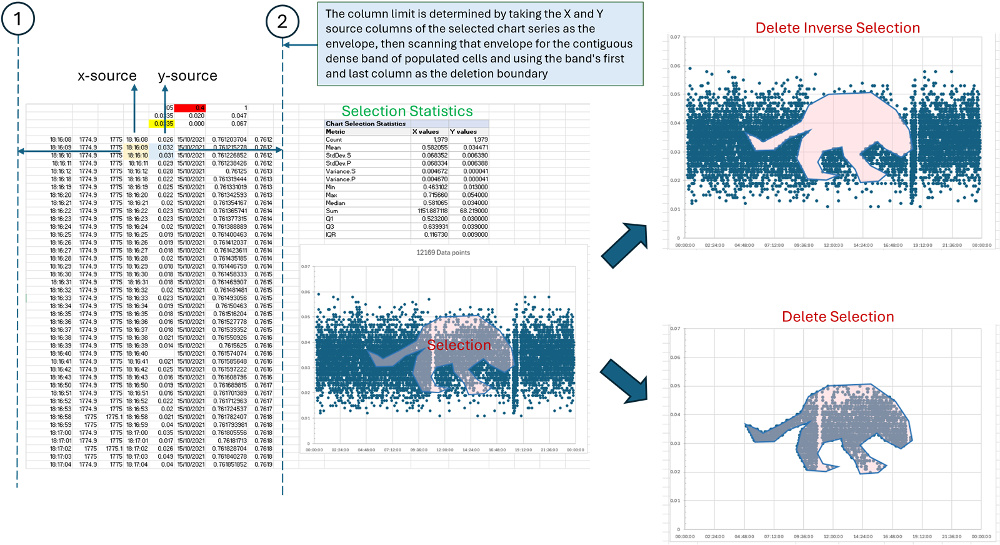

# ExcelChart Selection

ExcelChart Selection is an Excel add-in that lets you select chart points by drawing on the plot area. It offers three tools: a click-and-drag rectangle, a polyline, and a freehand lasso. Every point inside the shape you draw is selected, and the matching source rows are highlighted.

## What it offers over Excel's built-in tools

Excel cannot select chart points by drawing a region around them. Clicking points one by one is slow on a large series, and filtering the source table works from the numbers, not from what the chart shows. With this add-in you draw on the chart, and the points inside the shape are selected with their source rows highlighted.

Three details matter:

- The lasso is implemented inside the add-in, so it works regardless of whether your Excel build exposes a native lasso command.
- The shape is drawn through the chart's plot-area transform, so selections stay accurate when the chart is zoomed or the display uses high DPI scaling.
- The outline you draw stays on the chart after the selection, so the selected region remains visible while you work.

## What you can do

The add-in appears on the right-click menu of the chart area, a data point, a data series, the plot area, and the worksheet cell menu.

- Click-Drag Rectangle: press and drag to enclose points.
- Polyline: click to place vertices, then close the outline by clicking the first vertex, double-clicking, or using Close Polyline.
- Lasso: press and hold, draw a freehand outline, then release.
- Delete Selection: delete the source rows behind the selected points and compact the table.
- Delete Invert Selection: delete everything outside the selection.
- Calculate Statistics: write Count, Mean, standard deviation, variance, Min, Max, Median, Sum, Q1, Q3, and IQR for the selected X and Y values at K3 on the source sheet.
- Clear Selection: remove the highlight and the drawn outline.
- Cancel Selection Mode: leave the current tool without changing anything.
- Undo and Redo: step backwards and forwards through selection edits, including deletions and statistics.
- Object Persistence: keep the drawn outline after deleting rows, so it can be moved or duplicated with Ctrl+D to select another part of the chart.
- Refresh Chart Handlers: reattach the add-in to the charts in the active workbook.

## How deletion finds its column range

The delete commands work from the chart series' X and Y source columns. The unbroken band of populated columns between them becomes the deletion boundary.



## Install

1. Close every Excel window.
2. Double-click `Install ExcelChart Selection Add-in.cmd`.
3. Start Excel and open a workbook with a chart.

The installer copies `ExcelChart Selection.xlam` into your user add-ins folder and registers it through Excel. Uninstall with `Uninstall ExcelChart Selection Add-in.cmd`. Excel must restart after either action.

## Automation and agentic analysis

Every menu command maps to a public VBA procedure, so the add-in can be driven from PowerShell, Python, or any client that talks to Excel over COM. That includes AI agents, which can handle the whole workflow on their own. An agent starts a selection tool, draws the shape by simulating mouse input over the chart, reads the selected addresses and handler state, then deletes outliers, writes statistics, or undoes the step.

```powershell
$excel = New-Object -ComObject Excel.Application
$excel.Run("'ExcelChart Selection.xlam'!StartLassoSelectionMode")
# draw the lasso by simulating mouse input over the chart
$first = $excel.Run("'ExcelChart Selection.xlam'!GetFirstSelectedYCellAddress")
$diag = $excel.Run("'ExcelChart Selection.xlam'!GetChartSelectionDiagnostics")
```

The example starts the lasso tool, returns the first selected Y cell address, and returns the handler diagnostics. An agent uses those results to decide the next step, such as deleting the outliers, writing the statistics block, or undoing the change. Drawing is mouse-based, so the agent simulates mouse input over the chart window, and the add-in does not care whether the shape comes from a person or a script. The add-in owns the plot-area transform and the point-in-shape tests, so the agent only needs the chart's screen position and never re-implements the chart math itself.

## Package contents

- `ExcelChart Selection.xlam`: the add-in installed by the installer
- `ExcelChart Selection v1.2.xlam`: the current version, including the lasso tool, the data-point context menu, and object persistence
- `ExcelChart Selection v1.1.xlam`: the previous version, including the lasso tool and the data-point context menu
- `ExcelChart_Selection_Workbook.xlsm`: the development workbook with the same code embedded
- `ExcelChart Selection Demo.xlsx`: a small sample workbook with one series chart
- Install and Uninstall scripts
